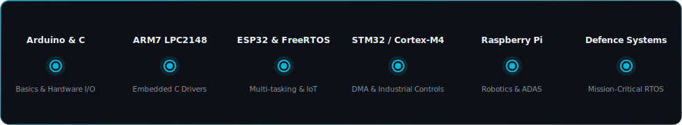
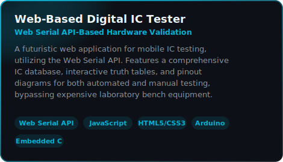
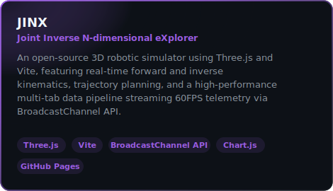
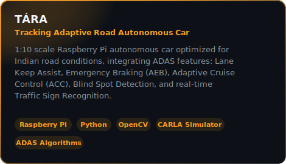
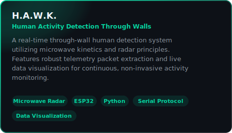
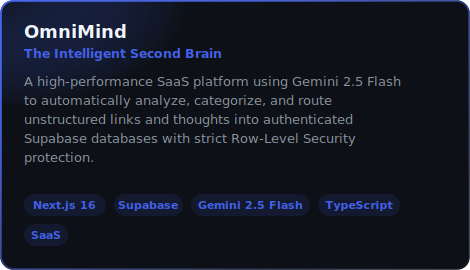
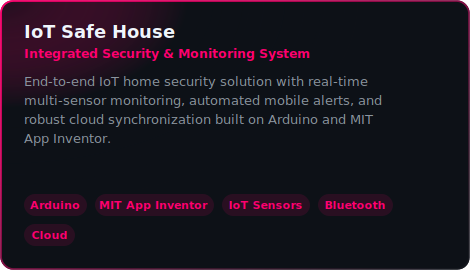
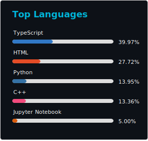

 

 

&nbsp;

&nbsp;

&nbsp;

  

#### **[About Me](#about-me) &nbsp;•&nbsp; [Latest Activity](#latest-activity) &nbsp;•&nbsp; [Latest Writings](#latest-writings) &nbsp;•&nbsp; [Tech Stack](#tech-stack) &nbsp;•&nbsp; [Skills Timeline](#skills-timeline) &nbsp;•&nbsp; [Projects](#projects) &nbsp;•&nbsp; [GitHub Analytics](#github-analytics) &nbsp;•&nbsp; [Achievements](#achievements) &nbsp;•&nbsp; [Certifications](#certifications)**

---

## About Me

- Embedded Systems Engineer focused on **FreeRTOS, firmware architecture, and hardware-software co-design**
- Building systems for **Defence Electronics, IoT, and Autonomous Platforms**
- Experienced with **ESP32, ARM Cortex-M4, Raspberry Pi, and low-level C firmware**
- 5× Hackathon podium finisher in industrial automation, hardware security, and robotics
- Approach every engineering problem like competitive badminton — observe, iterate, don't quit
- Always open to conversations about embedded systems, defence tech, or intelligent automation

---

## Latest Activity

<!-- LATEST_ACTIVITY:START -->
- Pushed to [chandansaipavanpadala/chandansaipavanpadala](https://github.com/chandansaipavanpadala/chandansaipavanpadala): new commits — Jun 12, 2026
- Pushed to [HackIndiaXYZ/vibe-coding-hackathon-2026-indias-largest-ai-web3-event-hackindia-noname](https://github.com/HackIndiaXYZ/vibe-coding-hackathon-2026-indias-largest-ai-web3-event-hackindia-noname): new commits — Jun 09, 2026
- Pushed to [chandansaipavanpadala/H.A.W.K-HumanActivityDetectionThroughWallsUsingMicrowaveKinetics](https://github.com/chandansaipavanpadala/H.A.W.K-HumanActivityDetectionThroughWallsUsingMicrowaveKinetics): new commits — Jun 04, 2026
- Starred [santifer/career-ops](https://github.com/santifer/career-ops) — Jun 03, 2026
<!-- LATEST_ACTIVITY:END -->

---

## Latest Writings

<!-- BLOG-POST-LIST:START -->
<!-- BLOG-POST-LIST:END -->

---

## Tech Stack

**Core Languages**

**Microcontrollers & Hardware Platforms**

**RTOS & Communication Protocols**

**Development Tools & Design Software**

**Technologies & Frameworks**

---

## Skills Timeline

  

---

## Projects

  &nbsp;&nbsp;
    
  &nbsp;&nbsp;
    
  &nbsp;&nbsp;

---

## GitHub Analytics

<table style="border: none; border-collapse: collapse; margin: 0 auto;">
  <tr style="border: none;">
    <td style="border: none; padding: 5px;" align="center" valign="middle">
      
    </td>
    <td style="border: none; padding: 5px;" align="center" valign="middle">
      
    </td>
  </tr>
  <tr style="border: none;">
    <td style="border: none; padding: 5px;" align="center" valign="middle">
      <picture>
        <source media="(prefers-color-scheme: dark)" srcset="./github-stats/github-activity-radar-Heart-Dark.svg">
        <source media="(prefers-color-scheme: light)" srcset="./github-stats/github-activity-radar-Heart-Light.svg">
        
      </picture>
    </td>
    <td style="border: none; padding: 5px;" align="center" valign="middle">
      
    </td>
  </tr>
  <tr style="border: none;">
    <td colspan="2" style="border: none; padding: 5px;" align="center" valign="middle">
      
    </td>
  </tr>
  <tr style="border: none;">
    <td colspan="2" style="border: none; padding: 5px;" align="center" valign="middle">
      <picture>
        <source media="(prefers-color-scheme: dark)" srcset="./github-stats/github-contribution-grid-snake-Dark.svg">
        <source media="(prefers-color-scheme: light)" srcset="./github-stats/github-contribution-grid-snake-Light.svg">
        
      </picture>
    </td>
  </tr>
</table>

---

<h2>Achievements</h2>

 

<table>
  <tr>
    <td width="33%" valign="top" align="center">
       
      
        
      <b>JIDO Automation Club</b> 
      April 2026
        
      
🏆 <b>19-Hour Hardware Security & System Recovery Challenge</b>

      
Decoded narrative ciphers, rewired sabotaged hardware circuits, and defended infrastructure against live simulated cyber-attacks.

       
      
        
    </td>
    <td width="33%" valign="top" align="center">
       
      
        
      <b>NEURON x JIDO</b> 
      March 2026
        
      
🏆 <b>Industrial Automation & AI Anomaly Detection Duel</b>

      
Applied PCA to clean noisy industrial datasets and deployed a Flask UI for real-time anomaly detection during a machine learning duel.

       
      
        
    </td>
    <td width="33%" valign="top" align="center">
       
      
        
      <b>JIDO Automation Club</b> 
      March 2026
        
      
🏆 <b>9-Phase Multi-Disciplinary Digital Twin Hackathon</b>

      
Navigated Webots drone simulations, validated ciphers, and built an Arduino "Hardware Heart" to command a robotic arm.

       
      
        
    </td>
  </tr>
</table>

<table>
  <tr>
    <td width="50%" valign="top" align="center">
       
      
        
      <b>Pragyan NIT Trichy</b> 
      February 2026
        
      
🛠️ <b>National-Level Hardware Design Hackathon</b>

      
Designed and prototyped innovative embedded solutions under strict time, power, and resource constraints at NIT Trichy.

       
      
        
    </td>
    <td width="50%" valign="top" align="center">
       
      
        
      <b>Next Chapter</b> 
      January 2025
        
      
💻 <b>Rapid Software & API Integration Hackathon</b>

      
Collaborated on building a fully functional software prototype, focusing on high-speed API routing, rapid state development, and web integrations.

       
      
        
    </td>
  </tr>
</table>

---

<h2>Certifications</h2>

 

<table>
  <tr>
    <td width="25%" valign="top" align="center">
       
      
        
      <b>Embedded Software Development</b> 
      EDUCBA • Jan 2026
        
      
Focuses on microcontroller interfacing, RTOS implementation, and optimizing ARM Cortex (STM32) embedded firmware.

       
      
        
    </td>
    <td width="25%" valign="top" align="center">
       
      
        
      <b>Network Security</b> 
      Google • Jan 2026
        
      
Covers network architecture, system hardening, intrusion detection, and traffic analysis using Wireshark and Python.

       
      
        
    </td>
    <td width="25%" valign="top" align="center">
       
      
        
      <b>Google Cybersecurity</b> 
      Google • Dec 2024
        
      
Comprehensive training in security foundations, network defense, incident response, SIEM tools, and threat analysis.

       
      
        
    </td>
    <td width="25%" valign="top" align="center">
       
      
        
      <b>Embedded for Beginners</b> 
      NIELIT • Jan 2026
        
      
Practical foundation in embedded system architectures, microcontroller peripheral interfacing, and register-level firmware development.

       
      
        
    </td>
  </tr>
  <tr>
    <td width="25%" valign="top" align="center">
       
      
        
      <b>MATLAB & Simulink</b> 
      NIELIT • Jan 2026
        
      
Covers modeling, system simulation, signal processing design, and programmatic control system workflows in MATLAB/Simulink.

       
      
        
    </td>
    <td width="25%" valign="top" align="center">
       
      
        
      <b>LabVIEW & EasyDAQ</b> 
      Expedition • Oct 2025
        
      
In-depth training in graphical system design, high-frequency data acquisition systems, and robust analog/digital sensor interfacing.

       
      
        
    </td>
    <td width="25%" valign="top" align="center">
       
      
        
      <b>AI & Ethical Hacking</b> 
      Workshop • Jan 2025
        
      
Trained in vulnerability assessment, penetration testing, and leveraging generative AI models for offensive/defensive security.

       
      
        
    </td>
    <td width="25%" valign="top" align="center">
       
      
        
      <b>Data Science Bootcamp</b> 
      Bootcamp • Completed
        
      
Intensive training in Python data analysis libraries, exploratory data analysis, and predictive machine learning models.

       
      
        
    </td>
  </tr>
</table>

---

**Always open to conversations about embedded systems, defence tech, or intelligent automation.**

