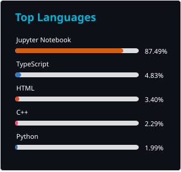

<picture>
  <source media="(prefers-color-scheme: dark)" srcset="./github-stats/github-contribution-grid-snake-Dark.svg">
  <source media="(prefers-color-scheme: light)" srcset="./github-stats/github-contribution-grid-snake-Light.svg">
  
</picture>
 
 

&nbsp;

&nbsp;

&nbsp;

---

## About Me

- Embedded Systems Engineer focused on **FreeRTOS, firmware architecture, and hardware-software co-design**
- Building systems for **Defence Electronics, IoT, and Autonomous Platforms**
- Experienced with **ESP32, ARM Cortex-M4, Raspberry Pi, and low-level C firmware**
- Approach every engineering problem like competitive badminton - observe, iterate, don't quit
- Always open to conversations about embedded systems, defence tech, or intelligent automation

---

## Latest Activity

<!-- LATEST_ACTIVITY:START -->
- Starred [tashfeenahmed/freellmapi](https://github.com/tashfeenahmed/freellmapi) — Aug 15, 2026
- Pushed to [madhumitha-m24/MyPortfolio](https://github.com/madhumitha-m24/MyPortfolio): new commits — Aug 14, 2026
- Pushed to [chandansaipavanpadala/jinx](https://github.com/chandansaipavanpadala/jinx): new commits — Aug 05, 2026
- Pushed to [chandansaipavanpadala/chandansaipavanpadala](https://github.com/chandansaipavanpadala/chandansaipavanpadala): new commits — Aug 02, 2026
- Activity (Public) in [chandansaipavanpadala/chandansaipavanpadala.github.io](https://github.com/chandansaipavanpadala/chandansaipavanpadala.github.io) — Mar 19, 2026
<!-- LATEST_ACTIVITY:END -->

---

## Tech Stack

**Core Languages**

**Microcontrollers & Hardware Platforms**

**RTOS & Communication Protocols**

**Development Tools & Design Software**

**Technologies & Frameworks**

---

## GitHub Analytics

<table style="border: none; border-collapse: collapse; margin: 0 auto;">
  <tr style="border: none;">
    <td colspan="2" style="border: none; padding: 5px;" align="center" valign="middle">
      
    </td>
  </tr>
  <tr style="border: none;">
    <td style="border: none; padding: 5px;" align="center" valign="middle">
      <picture>
        <source media="(prefers-color-scheme: dark)" srcset="./github-stats/github-activity-radar-Heart-Dark.svg">
        <source media="(prefers-color-scheme: light)" srcset="./github-stats/github-activity-radar-Heart-Light.svg">
        
      </picture>
    </td>
    <td style="border: none; padding: 5px;" align="center" valign="middle">
      
    </td>
  </tr>

</table>

